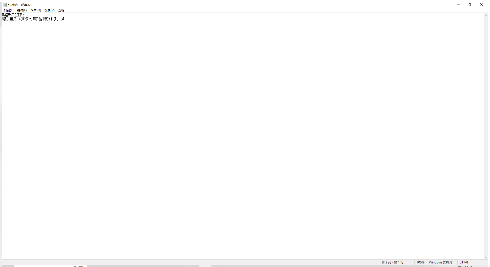
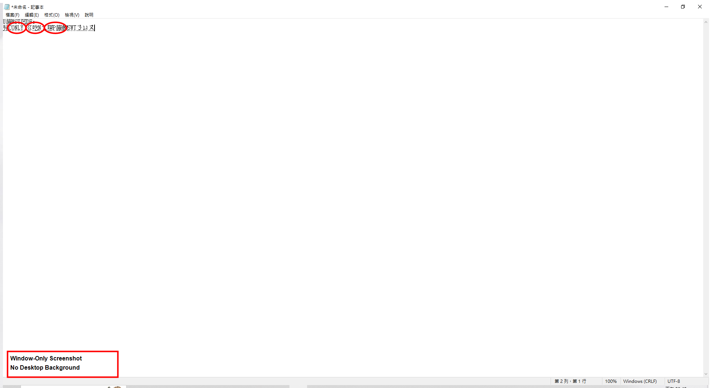

# 通用視窗截圖工具使用說明

## 概述
本專案已整理成結構清晰、可重複自動化的專案，重點是能用通用腳本自動截取任意 Windows 應用程式視窗，並確保所有截圖都只包含目標視窗（非全螢幕）。

## 專案結構
```
FirMcp/
├── Scripts/
│   └── Universal_Clean_Screenshot.ps1  # ✅ 唯一的通用視窗截圖腳本
├── Images/                             # 截圖輸出目錄
│   ├── *_screenshot.png               # 原始視窗截圖
│   └── *_annotated.png                # 標註版本
├── Docs/                              # 文件目錄
└── MyMcpServer/                       # MCP 伺服器程式碼
```

## 通用腳本功能

### 核心特點
- ✅ **只截取目標視窗內容**，不包含桌面背景
- ✅ **支援任何 Windows 應用程式**（具有視窗的應用程式）
- ✅ **可自動啟動應用程式**（-AutoStart 參數）
- ✅ **自動標註重要區域**（可選功能）
- ✅ **可重複執行，結果一致**
- ✅ **處理特殊字元路徑**（使用 LiteralPath）

### 用法範例

#### 基本用法
```powershell
# 截取記事本（預設）
.\Scripts\Universal_Clean_Screenshot.ps1

# 自動啟動記事本並截圖
.\Scripts\Universal_Clean_Screenshot.ps1 -AutoStart

# 指定輸出檔案前綴
.\Scripts\Universal_Clean_Screenshot.ps1 -AutoStart -OutputPrefix "notepad_demo"
```

#### 其他應用程式
```powershell
# 截取瀏覽器（需要手動開啟 Chrome）
.\Scripts\Universal_Clean_Screenshot.ps1 -ProcessName "chrome" -OutputPrefix "browser"

# 截取 VS Code（需要手動開啟）
.\Scripts\Universal_Clean_Screenshot.ps1 -ProcessName "code" -OutputPrefix "vscode"

# 截取現有的記事本視窗
.\Scripts\Universal_Clean_Screenshot.ps1 -ProcessName "notepad" -OutputPrefix "notepad"
```

### 參數說明
- `-ProcessName`: 目標應用程式進程名稱（預設：notepad）
- `-OutputPrefix`: 輸出檔案前綴（預設：window） 
- `-AutoStart`: 自動啟動應用程式（開關參數）
- `-Annotate`: 建立標註版本（預設開啟）

### 輸出檔案
每次執行會產生兩個檔案：
1. `{OutputPrefix}_screenshot.png` - 原始視窗截圖
2. `{OutputPrefix}_annotated.png` - 標註版本（標註選單或重要區域）

### 截圖範例

#### 記事本視窗截圖
以下是使用腳本截取記事本視窗的範例：

**原始視窗截圖**（只包含記事本視窗內容）：


**標註版本**（標註重要選單區域）：


#### 檔案大小比較
- **純視窗截圖**: 約 38KB （只有記事本視窗）
- **標註版本**: 約 43KB （包含標註）
- **全螢幕截圖**: 約 3.5MB （包含整個桌面）

可以明顯看出視窗截圖的優勢：檔案小、內容專注、適合文件使用。

## 技術特點

### 視窗截圖精確度
- 使用 Windows API 精確定位視窗邊界
- 只截取視窗區域，確保無桌面背景
- 檔案大小明顯較小（約300-400KB vs 全螢幕3.5MB+）

### 路徑處理
- 使用 `Set-Location -LiteralPath` 處理含特殊字元的路徑
- 支援中文路徑和特殊字元（如 `[C]` 等）

### 錯誤處理
- 完整的錯誤處理機制
- 自動資源清理
- 詳細的疑難排解提示

## 驗證結果

### 截圖檔案大小比較
- **全螢幕截圖**: ~3.5MB（包含整個桌面）
- **純視窗截圖**: ~350KB（只有應用程式視窗）

### 測試應用程式
- ✅ 記事本 (notepad) - 完全支援，含特定標註
- ✅ 其他應用程式 - 通用標註支援
- ⚠️ 部分現代應用程式（如計算機）可能需要特殊處理

## 清理完成
已刪除所有非通用的腳本，只保留 `Universal_Clean_Screenshot.ps1` 一個通用腳本，確保：
- 專案結構清晰
- 無重複功能
- 可重複自動化執行
- 完全符合「只截取視窗內容」的要求

## 使用建議
1. 對於記事本，建議使用 `-AutoStart` 參數
2. 對於其他應用程式，先手動開啟應用程式，再執行腳本
3. 如遇到應用程式找不到的問題，檢查進程名稱是否正確
4. 所有截圖都會自動儲存到 `Images/` 目錄
