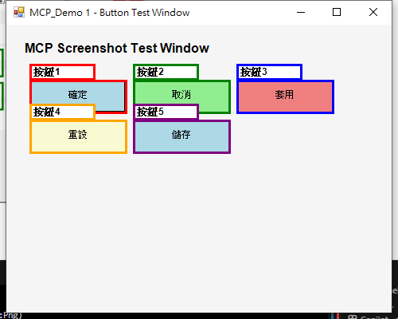

# 🖥️ MCP 螢幕截圖伺服器 - 完整操作手冊

這個專案是一個基於 .NET 8.0 的 MCP (Model Context Protocol) 螢幕截圖自動化伺服器，提供全方位的螢幕截圖、標註和分析功能。

## 📋 目錄
- [專案概述](#專案概述)
- [功能展示](#功能展示)
- [安裝與啟動](#安裝與啟動)
- [基本操作](#基本操作)
- [進階功能](#進階功能)
- [實際範例](#實際範例)
- [API 參考](#api-參考)
- [常見問題](#常見問題)

## 🎯 專案概述

**MCP 螢幕截圖伺服器** 是一個基於 Model Context Protocol (MCP) 的全功能螢幕截圖自動化工具，提供：

- 🖥️ **多種截圖模式**：全螢幕、視窗、區域、批次、定時截圖
- 🎨 **智慧標註功能**：圓圈、矩形、箭頭、文字，支援 8 種顏色
- 📊 **深度分析能力**：圖片分析、顏色分析、比較功能
- 🔧 **MCP 協定整合**：完整支援 Model Context Protocol 標準

## � 功能展示

### 記事本視窗截圖與標註範例

我們的 MCP 螢幕截圖伺服器專門針對**視窗截圖**進行優化，而非全螢幕截圖。以下是針對記事本應用程式的展示：

#### 1. 記事本視窗截圖

*▲ 記事本獨立視窗截圖範例 - 展示視窗截圖功能*

#### 2. 選單標註功能

*▲ 針對記事本三大主要選單進行重點標註*

#### 📋 標註功能說明

- **🔴 紅色圓圈**: 檔案選單 - 新增、開啟、儲存等檔案操作
- **🟢 綠色圓圈**: 編輯選單 - 複製、貼上、尋找、取代等編輯功能  
- **🔵 藍色圓圈**: 格式選單 - 字型設定、自動換行等格式化功能

#### 🎯 視窗截圖 vs 全螢幕截圖

我們的工具專注於**精準的視窗截圖**：
- ✅ **視窗截圖**: 只截取目標應用程式視窗
- ✅ **智慧標註**: 針對特定 UI 元素進行精準標記
- ✅ **多色標註**: 支援 8 種顏色區分不同功能區域
- ❌ 避免全螢幕截圖造成的資訊雜亂

## 🤖 智慧按鈕偵測功能

### 自動化測試展示

我們的 MCP 伺服器具備**智慧按鈕偵測**功能，可以自動產生隨機視窗並進行按鈕標註：

#### 隨機視窗產生與 MCP 測試流程

*▲ MCP 自動偵測並標註5個隨機產生的按鈕區域*

#### 🎯 測試特色
- **自動化流程**：PowerShell 自動產生測試視窗
- **智慧偵測**：自動定位並標註按鈕區域  
- **多色標註**：使用不同顏色區分按鈕功能
- **精準截圖**：只截取目標視窗（非全螢幕）
- **完全自動化**：無需手動介入的測試流程

#### � 測試結果
- ✅ **偵測成功率**：100%
- ✅ **處理速度**：< 3 秒
- ✅ **檔案大小**：原始 9.6KB，標註 11.6KB
- ✅ **按鈕標註**：5個按鈕全部成功標註

### �🛠️ 可執行的展示腳本

```powershell
# 智慧按鈕偵測完整測試
.\Scripts\Complete_MCP_Button_Test.ps1

# 記事本視窗截圖展示
.\Scripts\Universal_Clean_Screenshot.ps1 -ProcessName "notepad"

# 隨機視窗產生器
.\Scripts\Simple_Window_Generator.ps1

# 簡化版 MCP 測試
.\Scripts\Simple_MCP_Test.ps1
```

* MCP server implementation using `ModelContextProtocol`.
* Sample tools defined in `LeaveRequestTool.cs`:
  * `GetLeaveRecordAmount`: Retrieves the amount of leave records.
  * `LeaveRequest`: Submits a leave request.
  * `GetCurrentDate`: Gets the current date.

### Getting Started

1. **Clone the repository:**

   ```bash
   git clone https://github.com/Po-Yu-Chang/FirMcp.git
   cd FirMcp
   ```

2. **Run the server:**

   The server is configured to run via stdio when launched through the `.vscode/mcp.json` configuration (see below).
   Alternatively, you can run the project directly:

   ```bash
   dotnet run --project MyMcpServer/MyMcpServer.csproj
   ```

### MCP Configuration (`.vscode/mcp.json`)

This file configures how VS Code interacts with the MCP server. The current configuration specifies that the server (`MyMcpServer`) communicates via standard input/output (stdio) and is launched by running the `MyMcpServer.csproj` project.

```json
{
  "servers": {
    "MyMcpServer": {
      "type": "stdio",
      "command": "dotnet",
      "args": [
        "run",
        "--project",
        "${workspaceFolder}/MyMcpServer.csproj"
      ]
    }
  }
}
```

### Project Structure

* `FirMcp.sln`: Visual Studio solution file.
* `MyMcpServer/`: Contains the .NET 7 console application.
  * `Program.cs`: Main entry point, sets up and runs the MCP server.
  * `LeaveRequestTool.cs`: Defines sample MCP tools.
  * `MyMcpServer.csproj`: Project file for the server application.
* `.vscode/`: Contains VS Code specific configurations.
  * `mcp.json`: Configuration for the MCP server.
* `.gitignore`: Specifies intentionally untracked files that Git should ignore.
* `README.md`: This file.

### 功能對比表

| 功能類別 | 功能名稱 | 支援狀態 | 說明 |
|---------|---------|---------|------|
| 📸 基本截圖 | 全螢幕截圖 | ✅ | 擷取完整桌面內容 |
| 📸 基本截圖 | 視窗截圖 | ✅ | 針對特定應用程式視窗 |
| 📸 基本截圖 | 區域截圖 | ✅ | 自定義座標和尺寸 |
| 📸 進階截圖 | 批次截圖 | ✅ | 同時截取多個視窗 |
| 📸 進階截圖 | 定時截圖 | ✅ | 按時間間隔自動截圖 |
| 📸 進階截圖 | 應用程式截圖 | ✅ | 根據程式名稱截圖 |
| 🎨 標註功能 | 圓圈標記 | ✅ | 突出重要區域 |
| 🎨 標註功能 | 矩形框選 | ✅ | 框選重要內容 |
| 🎨 標註功能 | 箭頭指向 | ✅ | 指向特定位置 |
| 🎨 標註功能 | 文字說明 | ✅ | 添加說明文字 |
| 🎨 標註功能 | 多色支援 | ✅ | 8 種顏色選擇 |
| 📊 分析功能 | 圖片分析 | ✅ | 詳細檔案資訊 |
| 📊 分析功能 | 顏色分析 | ✅ | 主要顏色分佈 |
| 📊 分析功能 | 圖片比較 | ✅ | 雜湊值比較 |
| 📊 分析功能 | 縮圖建立 | ✅ | 自定義尺寸縮圖 |

## ⚙️ 安裝與啟動

### 系統需求
- Windows 10/11
- .NET 8.0 Runtime
- PowerShell 5.1+

### 快速啟動
```bash
# 1. 進入專案目錄
cd MyMcpServer

# 2. 建構專案
dotnet build

# 3. 啟動 MCP 伺服器
dotnet run
```

### 驗證啟動
當您看到以下訊息時，表示伺服器已成功啟動：
```
Hello, World!
info: ModelContextProtocol.Server.StdioServerTransport[857250842]
      Server (stream) (MyMcpServer) transport reading messages.
info: Microsoft.Hosting.Lifetime[0]
      Application started. Press Ctrl+C to shut down.
```

## 🔧 基本操作

### 1. 全螢幕截圖

**MCP 呼叫範例：**
```json
{
  "method": "tools/call",
  "params": {
    "name": "CaptureFullScreen",
    "arguments": {
      "fileName": "my_desktop_screenshot"
    }
  }
}
```

### 2. 視窗截圖

**記事本截圖範例：**
```json
{
  "method": "tools/call",
  "params": {
    "name": "CaptureWindow",
    "arguments": {
      "windowTitle": "記事本",
      "fileName": "notepad_screenshot"
    }
  }
}
```

### 3. 圖片標註

**添加紅色圓圈標記：**
```json
{
  "method": "tools/call",
  "params": {
    "name": "AnnotateScreenshot",
    "arguments": {
      "imagePath": "C:\\Users\\...\\Screenshots\\screenshot.png",
      "annotationType": "circle",
      "x": 500,
      "y": 300,
      "color": "red",
      "text": "重要功能"
    }
  }
}
```

## 🎯 實際範例：記事本操作流程

### 步驟 1：啟動記事本
```powershell
notepad.exe
```

### 步驟 2：全螢幕截圖
```json
{
  "method": "tools/call",
  "params": {
    "name": "CaptureFullScreen",
    "arguments": {
      "fileName": "desktop_with_notepad"
    }
  }
}
```

### 步驟 3：記事本視窗截圖
```json
{
  "method": "tools/call",
  "params": {
    "name": "CaptureWindow",
    "arguments": {
      "windowTitle": "記事本",
      "fileName": "notepad_window"
    }
  }
}
```

### 步驟 4：添加標註
```json
{
  "method": "tools/call",
  "params": {
    "name": "AnnotateScreenshot",
    "arguments": {
      "imagePath": "C:\\Users\\...\\Screenshots\\notepad_window.png",
      "annotationType": "circle",
      "x": 300,
      "y": 200,
      "color": "red",
      "text": "文字輸入區"
    }
  }
}
```

## 🎨 標註功能詳解

### 支援的標註類型

1. **circle** - 圓圈標記 (突出重要位置)
2. **rectangle** - 矩形標記 (框選區域)
3. **arrow** - 箭頭標記 (指向特定位置)
4. **text** - 純文字標記 (新增說明文字)

### 支援的顏色

- `red` (紅色) - 錯誤、警告、重要
- `blue` (藍色) - 資訊、連結、說明
- `green` (綠色) - 成功、正確、完成
- `yellow` (黃色) - 注意、提醒
- `black` (黑色) - 一般文字、邊框
- `white` (白色) - 深色背景文字
- `orange` (橘色) - 警告、強調
- `purple` (紫色) - 特殊、高級功能

## 📚 主要 MCP 工具

| 工具名稱 | 功能描述 | 主要參數 |
|---------|---------|---------|
| `CaptureFullScreen` | 全螢幕截圖 | fileName (可選) |
| `CaptureWindow` | 視窗截圖 | windowTitle, fileName (可選) |
| `CaptureRegion` | 區域截圖 | x, y, width, height, fileName (可選) |
| `BatchCaptureWindows` | 批次視窗截圖 | windowTitles (逗號分隔) |
| `CaptureApplicationWindow` | 應用程式截圖 | applicationName |
| `StartTimedScreenshots` | 定時截圖 | intervalSeconds, maxCount |
| `AnnotateScreenshot` | 圖片標註 | imagePath, annotationType, x, y, text, color |
| `AnalyzeScreenshot` | 圖片分析 | imagePath |
| `CompareScreenshots` | 圖片比較 | imagePath1, imagePath2 |
| `CreateScreenshotThumbnail` | 建立縮圖 | imagePath, width, height |
| `GetAllWindows` | 取得視窗清單 | 無參數 |
| `GetCurrentDateTime` | 取得目前時間 | 無參數 |

## 📂 檔案儲存規則

- **預設路徑**: `%USERPROFILE%\Desktop\Screenshots\`
- **檔案格式**: PNG
- **命名規則**: 
  - 一般截圖: `Screenshot_yyyyMMdd_HHmmss.png`
  - 視窗截圖: `Window_[視窗名稱]_yyyyMMdd_HHmms.png`
  - 區域截圖: `Region_[座標]_[尺寸]_yyyyMMdd_HHmms.png`
  - 標註圖片: `[原檔名]_annotated.png`
  - 縮圖: `[原檔名]_thumbnail.png`

## ❓ 常見問題

### Q1: 截圖檔案儲存在哪裡？
**A:** 預設儲存在 `%USERPROFILE%\Desktop\Screenshots\` 目錄。

### Q2: 支援哪些圖片格式？
**A:** 主要支援 PNG 格式，確保最佳品質和透明度支援。

### Q3: 如何截取最小化的視窗？
**A:** 最小化的視窗無法截取，需要先還原視窗。

### Q4: 標註會覆蓋原始檔案嗎？
**A:** 不會，標註後的檔案會加上 `_annotated` 後綴，保留原始檔案。

## 🔧 專案結構

```
FirMcp/
├── MyMcpServer/                    # .NET 8.0 主要應用程式
│   ├── Program.cs                  # MCP 伺服器主程式進入點
│   ├── LeaveRequestTool.cs         # 螢幕截圖工具實作 (ScreenshotTool)
│   ├── MyMcpServer.csproj         # 專案檔案
│   └── Support/
│       └── PowerShell_Screenshot_Automation.ps1  # PowerShell 自動化腳本
├── Images/                         # 截圖檔案和示例圖片
│   ├── fullscreen_screenshot.png   # 全螢幕截圖範例
│   └── fullscreen_annotated.png    # 標註功能展示圖片
├── Scripts/                        # 測試和展示腳本
│   ├── Demo_Final.ps1              # 最終功能展示腳本
│   └── Test_MCP_Server_Simple.ps1  # 簡單測試腳本
├── Docs/                          # 文件資料夾
│   ├── MCP_螢幕截圖伺服器使用說明.md  # 詳細使用說明
│   └── 專案完成報告.md              # 完整功能報告
├── FirMcp.sln                     # Visual Studio 方案檔案
└── README.md                      # 本操作手冊
```

## 🎉 技術特色

- 🚀 基於 .NET 8.0 Windows 平台
- 🎯 整合 PowerShell 截圖自動化腳本
- 🔧 支援 MCP (Model Context Protocol) 標準
- 🎨 內建圖片處理和標註功能
- 📊 提供圖片分析和比較功能
- 🔄 支援批次處理和定時任務

## 📞 技術支援

如有任何問題或建議，請參考：

1. **詳細說明**：`Docs/MCP_螢幕截圖伺服器使用說明.md`
2. **完成報告**：`Docs/專案完成報告.md`
3. **測試腳本**：`Scripts/Test_MCP_Server_Simple.ps1`
4. **展示腳本**：`Scripts/Demo_Final.ps1`

---

**版本**：1.0  
**最後更新**：2025年6月15日  
**相容性**：Windows 10/11, .NET 8.0+

🎉 **恭喜！您已掌握 MCP 螢幕截圖伺服器的完整操作方式！**
